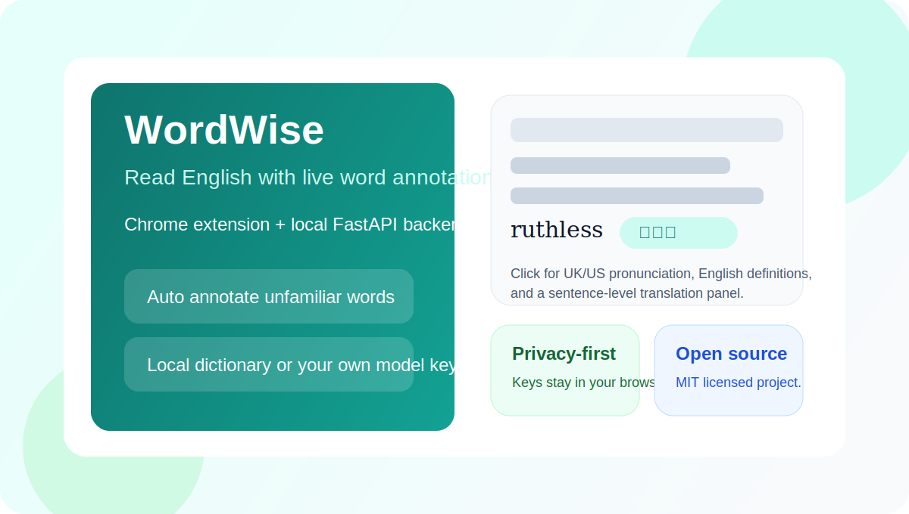
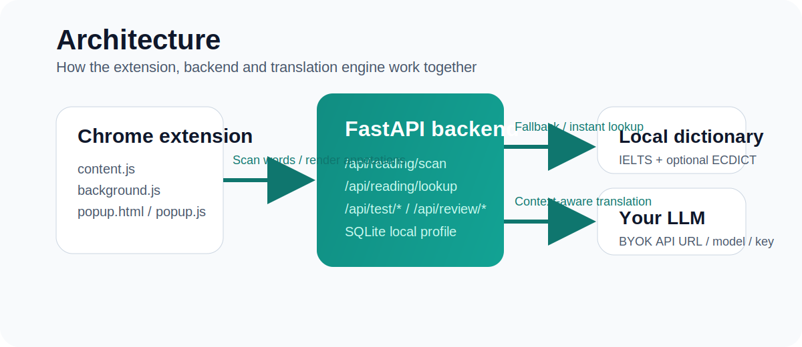

# WordWise

[English README](./README.md)



WordWise 是一个开源的英文网页阅读辅助工具。
它会在网页里直接标注你不熟悉的单词，点击后还能展开更完整的释义信息，并用本地学习档案记录你的阅读与复习过程。

当前仓库包含：

- Chrome 插件，位于 [`extension/`](./extension)
- 本地 FastAPI 后端，位于 [`backend/`](./backend)
- BYOK 模式：你的模型 Key 保存在浏览器本地，不上传到仓库

## 功能特点

- 浏览英文网页时自动给生词加括号注释
- 支持本地词典模式，响应快，适合基础离线查词
- 支持 Hybrid / Remote 模式，用你自己的 LLM 做语境翻译
- 点击单词可查看词性、多义、英音、美音、英文释义
- 支持词汇等级过滤与专业词典包
- 自带词汇测试与复习接口，可扩展为完整学习闭环
- 当前版本已去掉登录，默认使用匿名本地学习档案

## 架构图



## 目录结构

```text
backend/
  main.py
  routers/
  services/
  scripts/
extension/
  manifest.json
  background.js
  content.js
  popup.html
  popup.js
docs/
```

## 使用方式

### 1. 启动本地后端

```bash
cd backend
python3 -m venv .venv
source .venv/bin/activate
pip install -r requirements.txt
cp .env.example .env
uvicorn main:app --reload --host 0.0.0.0 --port 8000
```

当前插件默认连接 `http://localhost:8000`。

### 2. 加载插件

1. 打开 `chrome://extensions`
2. 开启右上角开发者模式
3. 点击“加载已解压的扩展程序”
4. 选择 `extension/` 目录

### 3. 配置翻译模式

插件支持三种模式：

- 仅本地词典
- Hybrid：本地优先，LLM 补全
- 仅远程 LLM

如果你启用 LLM，需要在插件设置里填写：

- API 地址
- 模型名称
- API Key

Key 只会保存在浏览器本地，并且只在阅读相关请求时附带给后端。

## 词典数据说明

这个仓库不会直接提交大体积生成文件。

已在 `.gitignore` 中排除：

- `backend/data/ecdict.db`
- `backend/data/ecdict.csv`
- `backend/data/ECDICT-master/`
- `backend/wordwise.db` 等本地运行数据库

如果你希望获得更完整的本地词典能力，需要自行下载 ECDICT，并构建 SQLite 索引：

```bash
cd backend
source .venv/bin/activate
python3 scripts/build_ecdict_index.py
```

也可以通过 `.env` 覆盖本地词典路径。

## 开源说明

- 开源协议：MIT
- 如果你在自己的环境里使用 ECDICT，请保留其上游 License
- 当前版本仍是“本地优先、开发者友好”的架构

## 当前限制

- 插件仍默认指向本地后端，而不是公网 API
- 词详情增强字段目前还没有完整持久化缓存
- 对 SPA、无限滚动页面的自动重扫还比较保守

## 后续计划

- 支持可配置后端地址或正式服务域名
- 补齐词详情缓存，降低重复 LLM 请求
- 提升 SPA / 懒加载页面的自动扫描能力
- 整理 Chrome 商店发布流程

## 开发定位

- 插件弹窗：`extension/popup.html`、`extension/popup.js`
- 页面标注逻辑：`extension/content.js`
- 后端入口：`backend/main.py`
- 阅读主链路：`backend/routers/reading.py`
- 翻译逻辑：`backend/services/translator.py`
