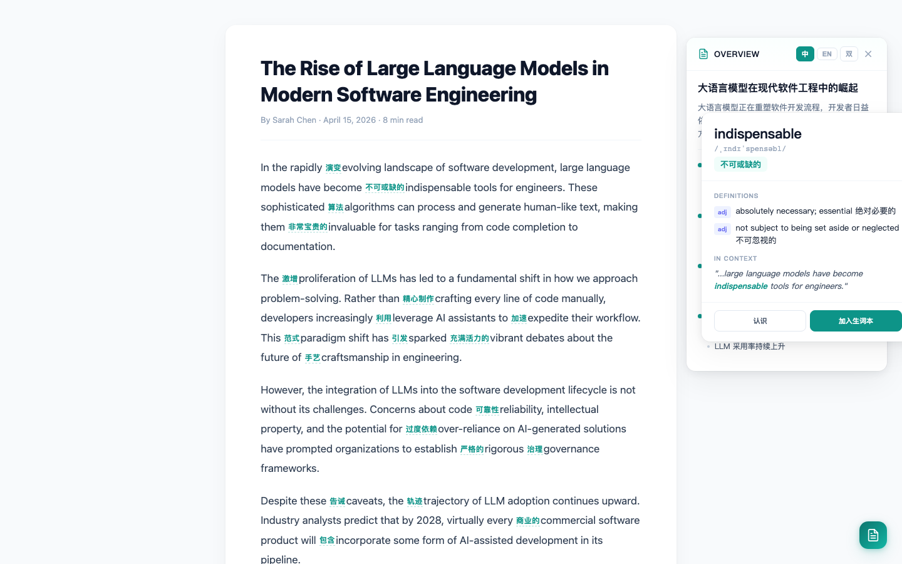
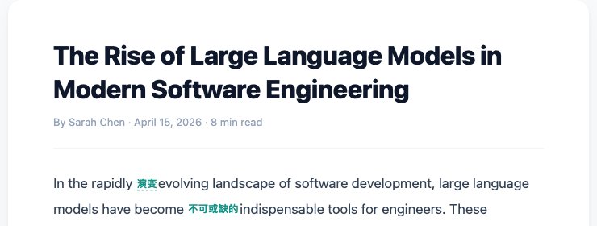
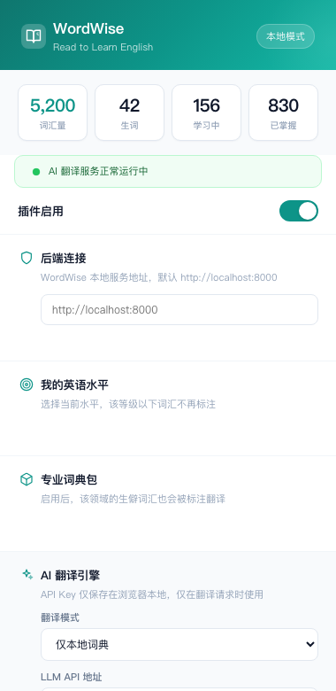
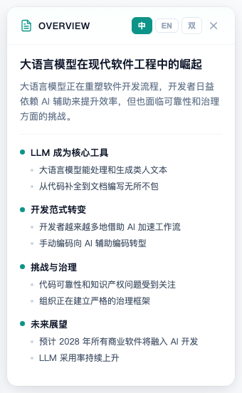
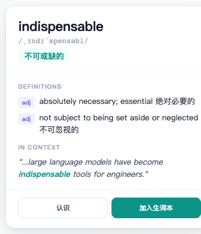

<p align="center">
  
</p>

<h1 align="center">WordWise</h1>

<p align="center">
  <strong>阅读即学词 — 智能标注生词，边读边学英语</strong>
</p>

<p align="center">
  <a href="./README.md">English</a> &middot;
  <a href="#快速开始">快速开始</a> &middot;
  <a href="#功能特点">功能特点</a> &middot;
  <a href="https://github.com/breeze-r/wordwise/issues">反馈建议</a>
</p>

<p align="center">
  
  
  
</p>

---

<p align="center">
  
</p>

## WordWise 是什么？

WordWise 是一个开源 Chrome 插件，帮助你在**日常英文阅读中自然地学习单词**。它会自动检测网页上你不熟悉的词汇，在原文中直接标注中文翻译，点击即可展开完整释义。

不需要专门开一个背单词 App——你每天浏览的英文网页，就是最好的学习材料。

## 功能特点

<table>
<tr>
<td width="50%">

### 行内标注
生词直接在文本流中标注简短中文释义，不打断阅读节奏。



</td>
<td width="50%">

### 插件弹窗
查看词汇统计、配置英语水平、启用专业词典包、管理 LLM 设置。



</td>
</tr>
<tr>
<td width="50%">

### AI 文章摘要
一键生成中英双语结构化大纲，提炼标题、核心观点、分段要点，支持 中文 / English / 双语 三种显示切换。



</td>
<td width="50%">

### 词义详情面板
点击标注词即可查看音标、词性、多义项释义，以及该词在原文语境中的用法。



</td>
</tr>
</table>

### 核心能力

- **智能词汇检测** — 根据你的词汇等级自动过滤常见词，只标注你真正需要学的词。
- **点击展开详情面板** — 音标、词性、多义项、语境用法、「加入生词本」一站式查看。
- **AI 文章摘要** — 一键生成结构化大纲：标题、概述、分段要点。支持 中文 / English / 双语 切换。
- **三种翻译模式**：
  - `仅本地词典` — 离线可用，基于 ECDICT（35万+ 词条）
  - `本地优先 + AI 补全` — 本地词典查不到的词，由 LLM 补充
  - `仅 AI 翻译` — 完全依赖 LLM 做语境翻译
- **词汇等级过滤** — 选择你的英语水平（初中 ~ 研究生），低于该等级的词不再标注。
- **专业词典包** — 支持 GRE、托福、医学、科技、法律、商务等领域词包。
- **BYOK 模式** — 你的 API Key 只保存在浏览器本地，仅在翻译请求时附带给后端，不会上传到任何服务器。
- **间隔重复** — 内置基于曝光次数的词汇复习系统。
- **隐私优先** — 无需注册账号，所有学习数据保存在本地。

## 架构

```
                  Chrome 插件                            本地后端
              ┌─────────────────────┐              ┌──────────────────────┐
  网页内容 ──> │  content.js         │   HTTP/JSON  │  FastAPI (Python)    │
              │  - 词汇检测          │ ──────────── │  - 词汇数据库         │
              │  - 行内标注          │              │  - ECDICT 查词        │
              │  - 详情面板          │              │  - LLM 代理转发       │
              │  - 摘要侧边栏        │              │  - 间隔重复           │
              ├─────────────────────┤              └──────────────────────┘
              │  background.js      │                        │
              │  - API 路由转发      │                  ┌─────┴─────┐
              │  - 配置存储          │                  │ LLM API   │
              ├─────────────────────┤                  │ (OpenAI,  │
              │  popup.html/js      │                  │  Claude,  │
              │  - 设置界面          │                  │  其他)     │
              └─────────────────────┘                  └───────────┘
```

## 快速开始

### 1. 启动后端服务

```bash
cd backend
python3 -m venv .venv
source .venv/bin/activate
pip install -r requirements.txt
cp .env.example .env          # 按需修改 .env
uvicorn main:app --reload --host 0.0.0.0 --port 8000
```

### 2. 加载插件

1. 打开 `chrome://extensions`
2. 打开右上角**开发者模式**
3. 点击**加载已解压的扩展程序**
4. 选择 `extension/` 目录

### 3. 配置（可选）

打开插件弹窗，按需配置：

| 设置项 | 说明 |
|--------|------|
| **后端地址** | 默认 `http://localhost:8000`，如果后端部署在其他位置可修改 |
| **翻译模式** | `仅本地词典` / `本地优先 + AI 补全` / `仅 AI 翻译` |
| **LLM API 地址** | 如 `https://api.openai.com/v1/chat/completions` |
| **模型名称** | 如 `gpt-4o-mini`、`claude-sonnet-4-20250514` 等 |
| **API Key** | 你的密钥，仅保存在浏览器本地 |

> **提示：** 使用「仅本地词典」模式不需要 API Key，基于内置 35 万词条的 ECDICT 词典即可获得基础翻译。

## 项目结构

```
wordwise/
├── extension/           # Chrome 插件（Manifest V3）
│   ├── manifest.json
│   ├── background.js    # Service Worker，API 路由
│   ├── content.js       # 页面标注、详情面板、摘要
│   ├── content.css      # 所有标注/面板/摘要样式
│   ├── popup.html/js    # 插件弹窗 UI
│   └── icons/           # 插件图标
├── backend/             # FastAPI 本地后端
│   ├── main.py          # 应用入口
│   ├── routers/         # API 路由
│   │   ├── reading.py   # /scan, /lookup, /summarize
│   │   ├── vocabulary.py
│   │   ├── review.py
│   │   ├── test.py
│   │   └── dict_packs.py
│   ├── services/        # 业务逻辑
│   │   ├── translator.py      # LLM 集成
│   │   ├── local_dictionary.py
│   │   ├── frequency.py
│   │   └── spaced_repetition.py
│   ├── models.py        # ORM 模型
│   ├── settings.py      # 环境变量配置
│   └── data/            # 词典数据（不跟踪）
└── docs/                # 截图与文档
```

## 词典数据

仓库不包含大体积词典文件。如需完整本地词典能力：

1. 下载 [ECDICT](https://github.com/skywind3000/ECDICT)
2. 将 CSV 数据放入 `backend/data/`
3. 构建 SQLite 索引：

```bash
cd backend && python3 scripts/build_ecdict_index.py
```

## 技术栈

| 层级 | 技术 |
|------|------|
| 插件 | Chrome Manifest V3, 原生 JS, CSS |
| 后端 | Python 3.11+, FastAPI, SQLAlchemy, SQLite |
| 词典 | ECDICT（35万+ 词条） |
| LLM | 任何 OpenAI 兼容接口（BYOK） |

## 参与贡献

欢迎提 Issue 或 PR！

1. Fork 本仓库
2. 创建特性分支 (`git checkout -b feature/amazing-feature`)
3. 提交改动
4. 推送到分支
5. 发起 Pull Request

## 开源协议

[MIT](./LICENSE)

---

<p align="center">
  <sub>多读多学，日积月累。</sub>
</p>
